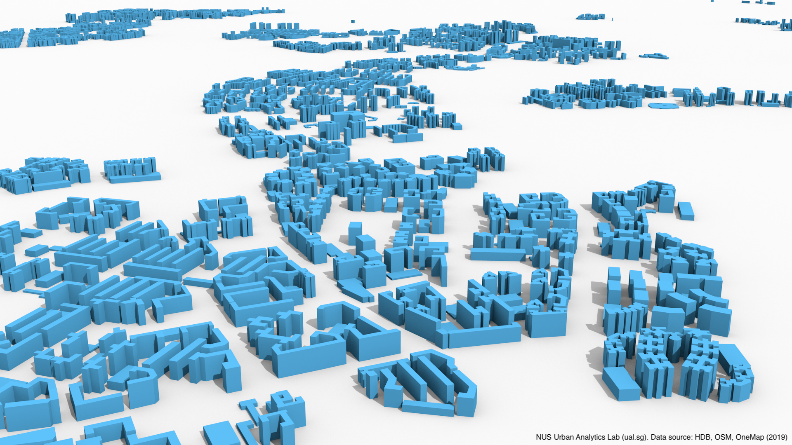

# Code to generate the 3D city model of Singapore public housing (HDB) buildings

Urban Analytics Lab, National University of Singapore



## Data

The data in CityJSON and OBJ is available on the [other Github repository](https://github.com/ualsg/hdb3d-data).

## Disclaimer

The code is very experimental and in an early stage. There are still many things to improve.

## Input data

You need to download the input datasets:
- [HDB Property Information](https://data.gov.sg/dataset/hdb-property-information)
- [OSM dump for Singapore](https://download.openstreetmap.fr/extracts/asia/)

and place them in the `_data/` directory.

## Method

The method is conceptually straightforward: OSM footprints are extruded to a height estimated from the number of storeys available in the HDB open dataset.
However, the implementation is not that straightforward because of the different datasets involved and difficulties in linking them.

OSM does not have addresses for about half of HDB blocks in Singapore, so it is not possible to easily associate the address from the HBD dataset to a corresponding feature in OSM (geocoding fails in half of the cases or it associates a wrong feature).

The open dataset [on buildings from the URA Master Plan 2014](https://data.gov.sg/dataset/master-plan-2014-building) could have been used, but it does not contain all buildings and it does not contain addresses.

Therefore it was required to use a geocoder (for each address a point in lat/lon is retrieved and then the corresponding feature in OSM can be found with a point in polygon operation). But this is not without issues either: Google Maps does not have a free API anymore, and OneMap (which was eventually used) sometimes returns a point that is outside the corresponding polygon in OSM (since their footprints don't always perfectly correspond).
These discrepancies caused a few errors.

## How to run the code

- Download the HDB open data on [Property Information](https://data.gov.sg/dataset/hdb-property-information)

- Download [OSM dumps for Singapore](https://download.openstreetmap.fr/extracts/asia/) in `osm.pbf` format

- Use [this code](https://github.com/tyrasd/osmtogeojson) to convert the `osm.pbf` file to `.geojson` (which is easier to handle):

`osmtogeojson singapore-latest.osm.pbf > singapore-latest.geojson`

- Geocoding is the first step

`python3 gc.py`

- Fetch the OSM polygon (may take some time, 7-8 hours)

`python3 hdbosm.py`

- Export 2D polygons into GeoJSON with all the attributes from OSM and HDB

`python3 hdb2d.py`

- Reproject to Singapore CRS (EPSG:3414)

`ogr2ogr -f "GeoJSON" _data/footprints_r.geojson _data/footprints.geojson -s_srs EPSG:4326 -t_srs EPSG:3414`

- Extrude polygons to 3D (code mostly courtesy of [cityjson-software](https://github.com/tudelft3d/cityjson-software/blob/master/extruder/extruder.py)) and output a CityJSON dataset with

`python3 hdb3d.py`

- Optional: Upgrade the dataset to CityJSON v 1.0

`cjio _data/hdb.json upgrade_version save _data/hdb.json`

- Optional: Export to OBJ

`cjio _data/hdb.json export _data/hdb.obj`

## Output

The workflow produces [CityJSON](https://cityjson.org) and [OBJ](https://en.wikipedia.org/wiki/Wavefront_.obj_file) files.
A byproduct of the process is a [GeoJSON](https://geojson.org) 2D dataset of HDB footprints.
The files can be downloaded from the [data repository](https://github.com/ualsg/hdb3d-data).

This is an example of the data rendered in Blender:


It isn't too difficult to also visualise them in [Mapbox](https://www.mapbox.com):


CityJSON and OBJ files are supported by many different software packages.

## Citation/credit 

If using the code and data, please mention the following data sources: NUS Urban Analytics Lab, HDB Singapore, OpenStreetMap contributors, and OneMap. If you are using it for a nice publication, please cite the following paper:

```
@article{ceus_inferring_heights,
    author = {Biljecki, Filip and Ledoux, Hugo and Stoter, Jantien},
    title = {{Generating 3D city models without elevation data}},
    journal = {Computers, Environment and Urban Systems},
    year = {2017},
    volume = {64},
    pages = {1--18},
    month = jul
}
```

## More information

Please read more about the data on the [other Github repository](https://github.com/ualsg/hdb3d-data).
You may also want to read [the article on our group's website](https://ual.sg/post/2019/08/25/release-of-3d-building-open-data-of-hdbs-in-singapore/).
